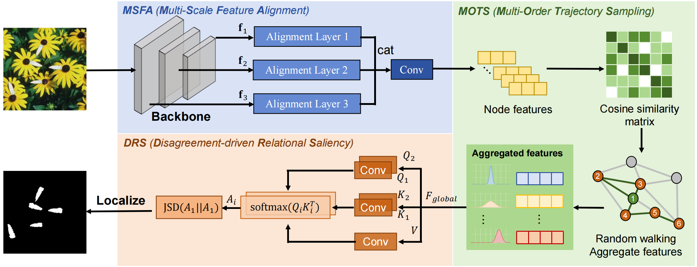
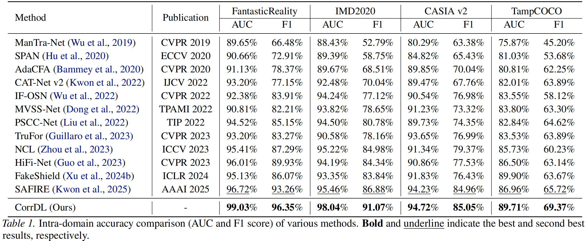
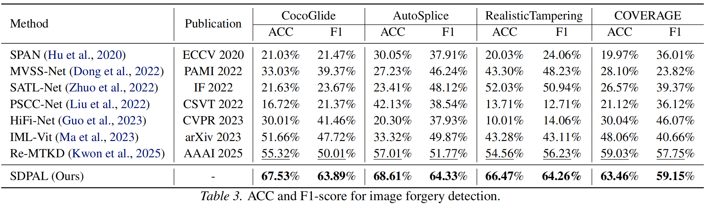

# CorrDL: Correlation Disagreement Learning forForgery Detection and Localization

Generative image models have greatly lowered the cost of producing high-quality forgeries, making robust pixel-level detection and localization under cross-domain and emerging scenarios more challenging. We reinterpret forgery detection as identifying consistency violations on a pixel correlation graph: real regions show stable multi-order correlation propagation, while forged regions in duce cross-scale conflicts and unstable propagation patterns.Based on this view, we propose CorrDL, which learns multi-order correlation trajectories via a random-walk-with-restart kernel and measures anomalies through the disagreement be tween dual-relation attention distributions. This design explicitly amplifies real–forged pattern conflicts and enhances boundary sensitivity. CorrDL is end-to-end trainable and compatible with standard segmentation losses, improving localization of small and ambiguous regions while main taining stable training. Extensive experiments show that CorrDL achieves stronger generalization and nearly 5% F1 gains in detection and localization over recent methods across multiple benchmarks.



## Get Started

1. Install Python 3.10, PyTorch >= 2.8.
2. Train and evaluate. You can reproduce the experiment results on CASIA v2 dataset as follows:

```python
python main.py
```

## Main Result

**Intra-domain Accuracy Comparison.** Table 1 reports each method's localization performance in terms of F1 score and AUC. We observe that CorrDL achieves the highest performance on FantasticReality, IMD2020, CASIA v2 and TampCOCO datasets.



**Cross-domain Generalization Comparison.** As shown in Table 2, on the COVERAGE test set, CorrDL achieved F1 and AUC scores second only to SAFIRE, a method proposed in 2025. This indicates that CorrDL demonstrates superior anti-interference capability and robustness compared to other methods when handling high-fidelity tampering scenarios.


As shown in Table 3, our CorrDL approach achieves nearoptimal performance across various manipulation types and testing domains. For instance, on the CocoGlide dataset, our method surpasses the second-best approach Re-MTKD by 12.21% in accuracy and 13.88% in F1 score. Notably, because CorrDL explicitly amplifies the pattern conflicts between authentic and forged regions, it exhibits stronger generalization capability across diverse datasets compared to other models.


